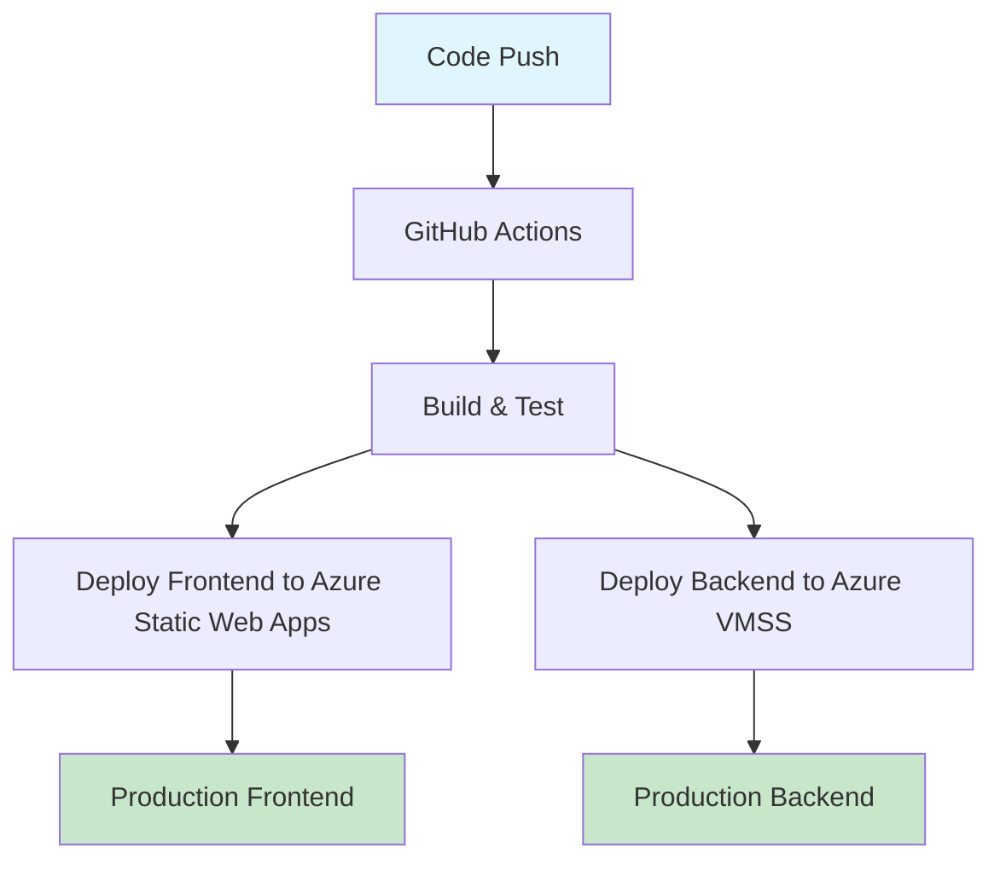
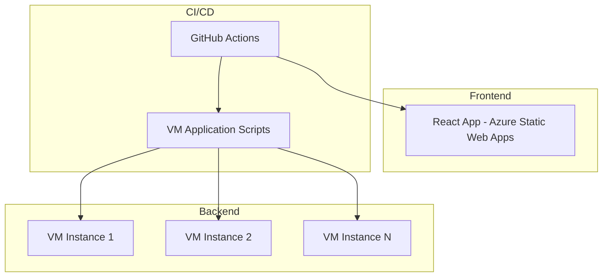
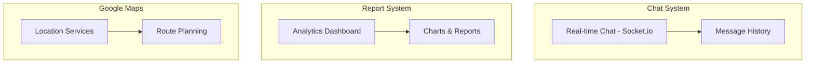
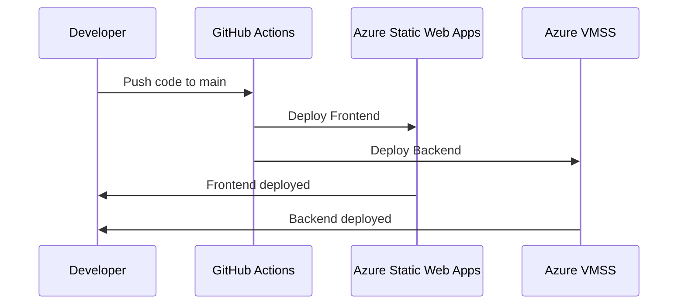
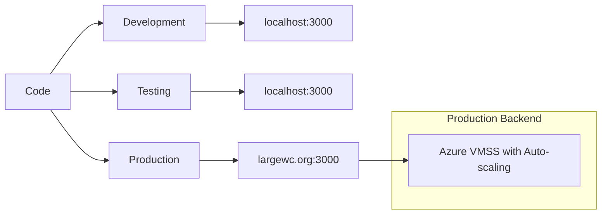

# TrustaSitter CI/CD with Azure VMSS Backend

## Main CI/CD Flow

```mermaid
graph TD
    A[Code Push] --> B[GitHub Actions]
    B --> C[Build & Test]
    C --> D[Deploy Frontend to Azure Static Web Apps]
    C --> E[Deploy Backend to Azure VMSS]
    D --> F[Production Frontend]
    E --> G[Production Backend]
    
    style A fill:#e1f5fe
    style F fill:#c8e6c9
    style G fill:#c8e6c9
```

## System Architecture

```mermaid
graph TB
    subgraph "Frontend"
        F[React App - Azure Static Web Apps]
    end
    
    subgraph "Backend"
        B1[VM Instance 1]
        B2[VM Instance 2]
        B3[VM Instance N]
    end
    
    subgraph "CI/CD"
        G[GitHub Actions]
        V[VM Application Scripts]
    end
    
    G --> F
    G --> V
    V --> B1
    V --> B2
    V --> B3
```

## Three New Features

```mermaid
graph TD
    subgraph "Chat System"
        C1[Real-time Chat - Socket.io]
        C2[Message History]
    end
    
    subgraph "Report System"
        R1[Analytics Dashboard]
        R2[Charts & Reports]
    end
    
    subgraph "Google Maps"
        M1[Location Services]
        M2[Route Planning]
    end
    
    C1 --> C2
    R1 --> R2
    M1 --> M2
```

## Deployment Process

```mermaid
sequenceDiagram
    participant Dev as Developer
    participant GH as GitHub Actions
    participant SWA as Azure Static Web Apps
    participant VMSS as Azure VMSS
    
    Dev->>GH: Push code to main
    GH->>SWA: Deploy Frontend
    GH->>VMSS: Deploy Backend
    SWA->>Dev: Frontend deployed
    VMSS->>Dev: Backend deployed
```

## Environment Setup

```mermaid
graph LR
    A[Code] --> B[Development]
    A --> C[Testing]
    A --> D[Production]
    
    B --> E[localhost:3000]
    C --> F[localhost:3000]
    D --> G[largewc.org:3000]
    
    subgraph "Production Backend"
        H[Azure VMSS with Auto-scaling]
    end
    
    G --> H
``` 