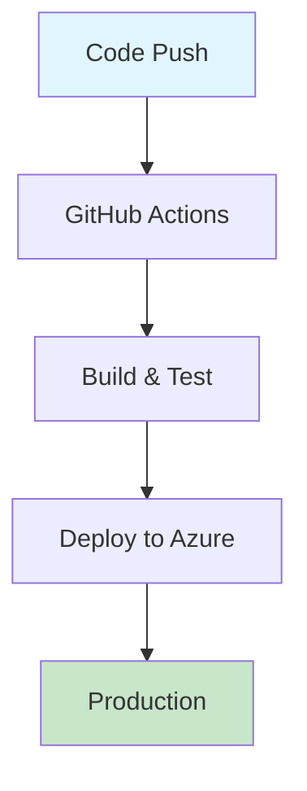
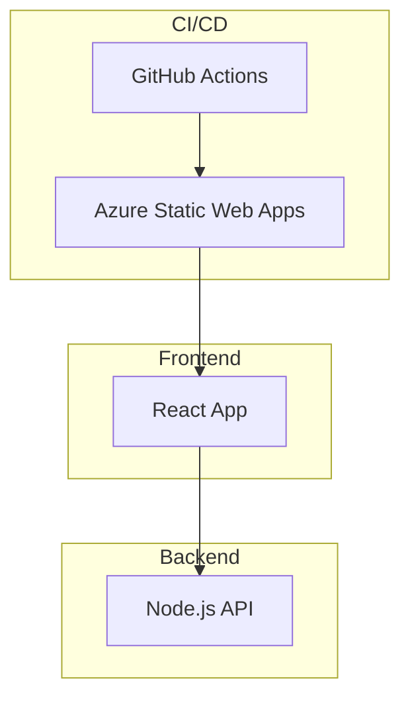
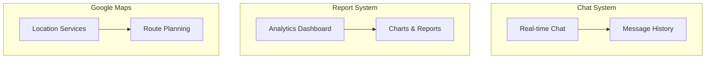
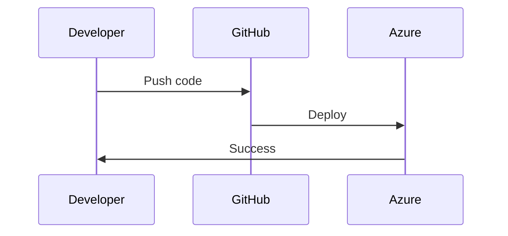
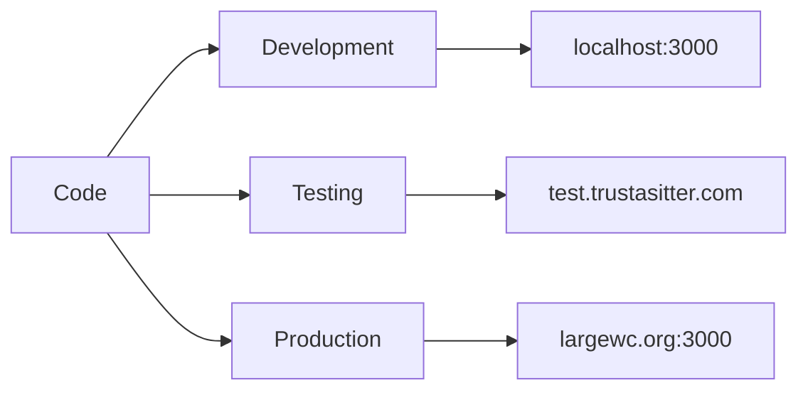

# TrustaSitter CI/CD - Simple Version

## Main CI/CD Flow

```mermaid
graph TD
    A[Code Push] --> B[GitHub Actions]
    B --> C[Build & Test]
    C --> D[Deploy to Azure]
    D --> E[Production]
    
    style A fill:#e1f5fe
    style E fill:#c8e6c9
```

## System Architecture

```mermaid
graph TB
    subgraph "Frontend"
        F[React App]
    end
    
    subgraph "Backend"
        B[Node.js API]
    end
    
    subgraph "CI/CD"
        G[GitHub Actions]
        A[Azure Static Web Apps]
    end
    
    G --> A
    A --> F
    F --> B
```

## Three New Features

```mermaid
graph TD
    subgraph "Chat System"
        C1[Real-time Chat]
        C2[Message History]
    end
    
    subgraph "Report System"
        R1[Analytics Dashboard]
        R2[Charts & Reports]
    end
    
    subgraph "Google Maps"
        M1[Location Services]
        M2[Route Planning]
    end
    
    C1 --> C2
    R1 --> R2
    M1 --> M2
```

## Deployment Process

```mermaid
sequenceDiagram
    participant Dev as Developer
    participant GH as GitHub
    participant Azure as Azure
    
    Dev->>GH: Push code
    GH->>Azure: Deploy
    Azure->>Dev: Success
```

## Environment Setup

```mermaid
graph LR
    A[Code] --> B[Development]
    A --> C[Testing]
    A --> D[Production]
    
    B --> E[localhost:3000]
    C --> F[test.trustasitter.com]
    D --> G[largewc.org:3000]
``` 